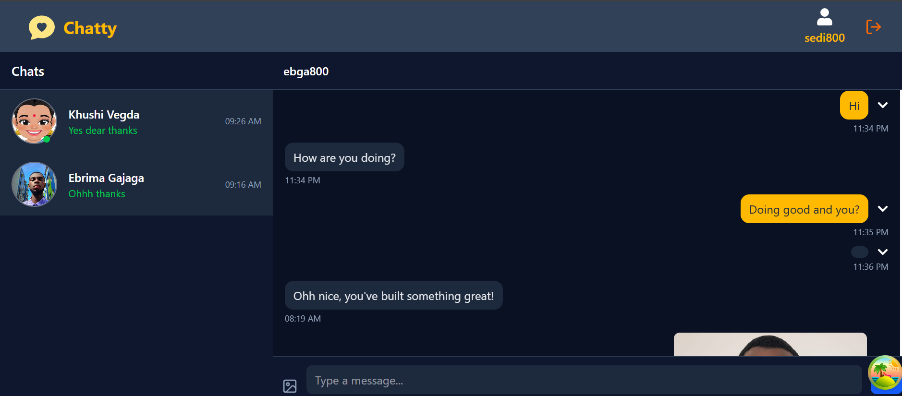

# ✨ Chatty — Real-Time Chat Application

Chatty is a full-stack, real-time chat application built with **Node.js**, **Express**, **MongoDB**, **React**, and **Socket.IO**.  
It enables users to send and receive messages instantly, view online statuses, manage their profiles, and enjoy a seamless chat experience with smart caching and synchronization.

## 

## 🚀 Features

### 🔐 Authentication & Authorization

- Secure **JWT-based authentication** (access + refresh tokens)
- **Role-based route protection** using middleware
- Persistent login via **HttpOnly cookies**

---

### 💬 Real-Time Messaging

- **Socket.IO** for instant message delivery
- Live message updates without refresh
- Real-time conversation sync across users

---

### ⚡ Data Fetching & Caching

- **React Query (TanStack Query)** for efficient data handling
- Automatic cache updates when messages change
- Optimistic UI updates for smooth experience

---

### 📨 Message Management

- Full **CRUD operations**:
  - Send text and image messages
  - Soft delete messages with timestamps
  - Update messages (optional)
  - Paginated message history
- **Cloudinary integration** for image uploads

---

### 🟢 Online Status & Live Updates

- Real-time online/offline tracking via Socket.IO
- Dynamic “online” indicators
- Automatic removal of disconnected users

---

### 👤 User & Profile Management

- Signup, login, and logout
- Update profile picture (Cloudinary)
- Edit user details

---

### 📄 Pages

- **Login / Signup** – Secure authentication
- **Home** – Chat interface with messages and online users
- **Profile** – Manage user info and avatar

---

## 🏗️ Tech Stack

### 🎨 Frontend

- ⚛️ React + Vite
- 🔌 Socket.IO Client
- ⚡ React Query (TanStack Query)
- 🧠 Zustand (global state)
- 🎨 Tailwind CSS
- 🔔 Audio notifications

---

### 🛠️ Backend

- 🟢 Node.js + Express
- 🍃 MongoDB + Mongoose
- 🔐 JWT Authentication
- ☁️ Cloudinary
- 🔌 Socket.IO Server

---

## 🔐 Environment Variables

### Create a `config.env` file in your backend folder:

`
CLOUDINARY_API_KEY=
CLOUDINARY_API_SECRET=
CLOUDINARY_CLOUD_NAME=

JWT_COOKIE_EXPIRES_IN=7
JWT_SECRET=your_super_secret_key
JWT_SECRET_EXPIRES_IN=7d

MONGO_URI=

NODE_ENV=development
PORT=5000
`

## ⚙️ Installation & Setup

### 1️⃣ Clone Repository

```
git clone https://github.com/thanos14million605/Chatty.git
cd chatty
```

## 2️⃣ Install Dependencies

### Backend

```
cd backend
npm install
```

### Frontend

```
cd frontend
npm install
```

## ▶️ Running the Application

### Start Backend

```
cd backend
npm run server
```

### Start Frontend

```
cd frontend
npm run client
```

## 🚀 Deployment

### Deployed on Render

- Add environment variables in Render dashboard
- Set build & start commands respectively as follows:

```
npm run build
npm run start
```

## 🔄 Core Workflow

1. **User signs up / logs in**
2. **JWT token** is issued
3. **Socket.IO** connection is established
4. **Messages** are sent & received instantly
5. **Online users** are tracked dynamically

## 🔒 Security

Password hashing for user credentials
JWT-based authentication system
Secure cookies for session persistence
Environment variables for sensitive data

## 🧠 Key Learnings

1. **Building scalable real-time systems** with Socket.IO
2. **Managing server-client synchronization**
3. **Efficient state management** with Zustand & React Query
4. **Secure authentication** implementation
5. **Full-stack** deployment workflow

## 👨🏽‍💻 Author

`Ebrima Gajaga`

## 🔗 GitHub:

https://github.com/thanos14million605

## ❤️ Acknowledgements

1. **Inspired by** modern chat applications
2. **Built as part of my final semester internship in India**

## Built with love ❤️ using the MERN stack and Socket.IO
